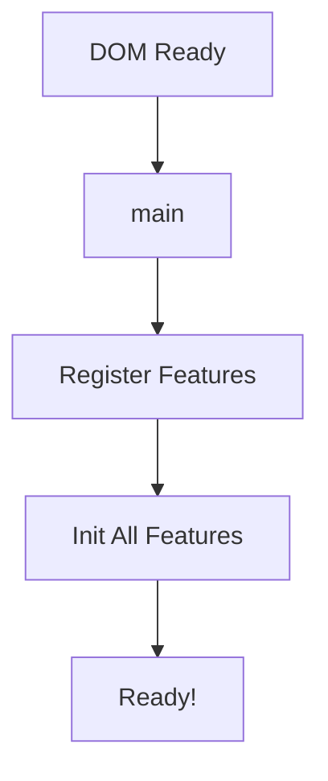
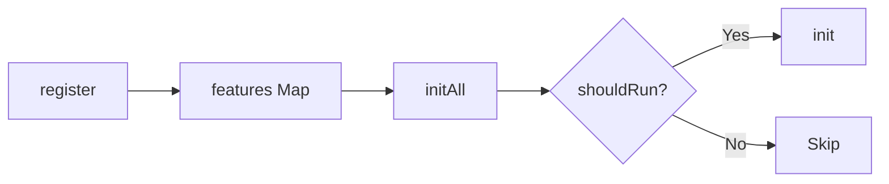
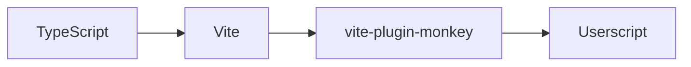
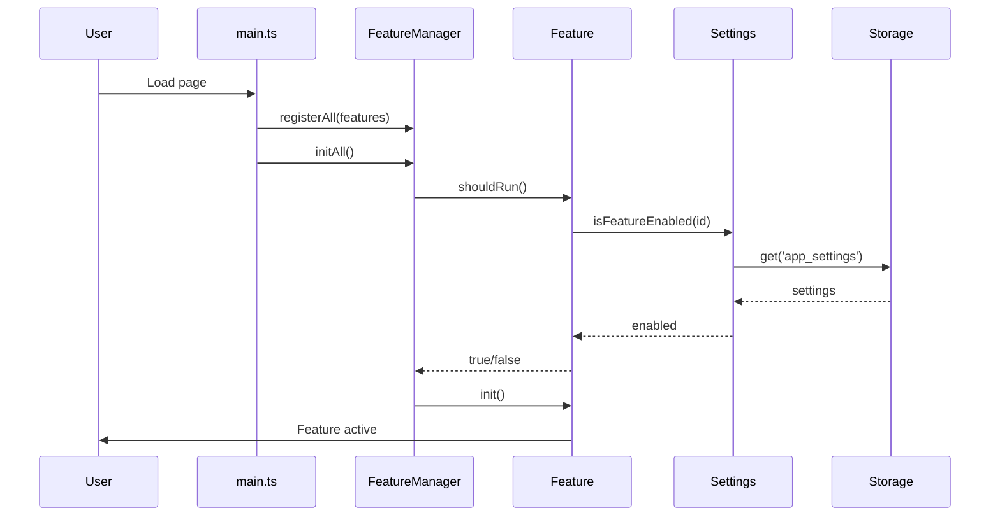

# 🏗️ Kiến trúc dự án SV HaUI Helper

Tài liệu mô tả kiến trúc tổng quan của SV HaUI Helper - một userscript tăng cường trải nghiệm cổng sinh viên HaUI.

---

## 📐 Tổng quan

```
┌─────────────────────────────────────────────────────────────────────┐
│                           Userscript                                │
├─────────────────────────────────────────────────────────────────────┤
│  main.ts (Entry Point)                                              │
│     ├── FeatureManager (Orchestrator)                               │
│     │      ├── Feature 1: Dynamic Title                             │
│     │      ├── Feature 2: Captcha Helper                            │
│     │      └── Feature N: ...                                       │
│     ├── Settings (User Preferences)                                 │
│     └── Logger (Debug & Monitoring)                                 │
├─────────────────────────────────────────────────────────────────────┤
│  Storage Layer (GM_* APIs via vite-plugin-monkey)                   │
└─────────────────────────────────────────────────────────────────────┘
```

---

## 📁 Cấu trúc thư mục

```
src/
├── main.ts              # Entry point - khởi tạo ứng dụng
├── core/                # Lõi hệ thống
│   ├── feature.ts       # Base class cho features
│   ├── feature-manager.ts   # Quản lý vòng đời features
│   ├── settings.ts      # Quản lý cài đặt người dùng
│   ├── constants.ts     # Giá trị mặc định
│   ├── storage.ts       # Type-safe GM storage wrapper
│   ├── logger.ts        # Hệ thống logging
│   └── index.ts         # Re-export
├── features/            # Các tính năng
│   ├── dynamic-title/   # Tự động đổi tiêu đề tab
│   ├── captcha-helper/  # Hỗ trợ nhập captcha
│   └── index.ts         # Feature registry
├── utils/               # Tiện ích dùng chung
│   ├── text-utils.ts    # Xử lý text (remove diacritics, telex)
│   ├── dom.ts           # DOM utilities
│   └── index.ts         # Re-export
└── types/               # TypeScript types
    └── index.ts         # Schema definitions
```

---

## 🔧 Các thành phần chính

### 1. Entry Point (`main.ts`)



- Đăng ký tất cả features với `FeatureManager`
- Khởi tạo các features phù hợp với URL hiện tại
- Hiển thị banner console

### 2. Feature Base Class (`core/feature.ts`)

Abstract class định nghĩa interface cho mọi feature:

```typescript
abstract class Feature {
    id: string;           // Unique identifier
    name: string;         // Display name
    description: string;  // Mô tả
    urlMatch?: RegExp;    // Pattern URL để chạy
    
    shouldRun(): boolean;       // Kiểm tra có nên chạy
    abstract init(): void;      // Khởi tạo feature
    destroy(): void;            // Cleanup
}
```

**Đặc điểm:**
- Tự động tạo logger với prefix từ tên feature
- Hỗ trợ URL matching (regex hoặc string)
- Kiểm tra enabled/disabled từ settings

### 3. Feature Manager (`core/feature-manager.ts`)

Singleton quản lý vòng đời features:



- **`register(feature)`**: Đăng ký feature
- **`registerAll(features)`**: Đăng ký nhiều features
- **`initAll()`**: Khởi tạo các features matching URL
- **`get(id)`**: Lấy feature theo ID

### 4. Settings Manager (`core/settings.ts`)

Quản lý cài đặt người dùng:

```typescript
{
    logLevel: 'debug' | 'info' | 'warn' | 'error' | 'none',
    features: { [featureId]: boolean },
    captchaUndoTelex: boolean
}
```

- Lưu/load từ GM storage
- Cho phép bật/tắt từng feature
- Điều chỉnh log level

### 5. Storage (`core/storage.ts`)

Type-safe wrapper cho GM_* APIs:

```typescript
storage.get('app_settings', defaultValue);
storage.set('app_settings', value);
storage.remove('app_settings');
```

### 6. Logger (`core/logger.ts`)

Hệ thống logging với:
- **Log levels**: debug < info < warn < error < none
- **Prefix & Icons**: Hiển thị nguồn log với emoji
- **Bind trick**: Line number chính xác trong DevTools
- **Child logger**: Tạo logger con với sub-prefix

---

## 🛠️ Build System

### Vite + vite-plugin-monkey



**Build commands:**
- `pnpm dev`: Development với hot reload
- `pnpm build`: Build readable version
- `pnpm build:minify`: Build minified version
- `pnpm build:all`: Build cả hai versions

**Output:**
- `dist/svhaui-helper.user.js` (readable)
- `dist/svhaui-helper.min.user.js` (minified)

---

## 🔄 Luồng dữ liệu



---

## 📦 Dependencies

| Package | Mục đích |
|---------|----------|
| `vite` | Build tool |
| `vite-plugin-monkey` | Userscript bundler |
| `typescript` | Type safety |
| `eslint` | Linting |
| `prettier` | Code formatting |

---

## 🚀 Thêm Feature mới

Xem hướng dẫn chi tiết: [Creating Features](docs/creating-features.md)

---

## 📝 Coding Conventions

- **Naming**: camelCase cho variables/functions, PascalCase cho classes
- **Comments**: English cho code, Vietnamese cho user-facing text
- **Logging**: Sử dụng `this.log.d/i/w/e()` trong features
- **Error handling**: Luôn log errors, fail fast
- **Immutability**: Ưu tiên tạo bản sao thay vì mutate

---

## 🔗 Liên kết

- [README.md](README.md) - Hướng dẫn sử dụng
- [CONTRIBUTING.md](CONTRIBUTING.md) - Hướng dẫn đóng góp
- [CHANGELOG.md](CHANGELOG.md) - Lịch sử thay đổi
- [API Reference](docs/api-reference.md) - Tài liệu API
