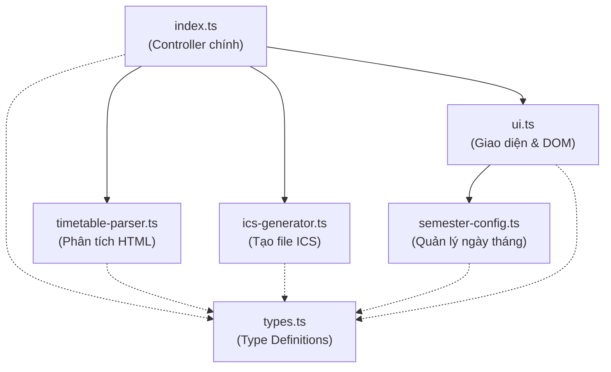
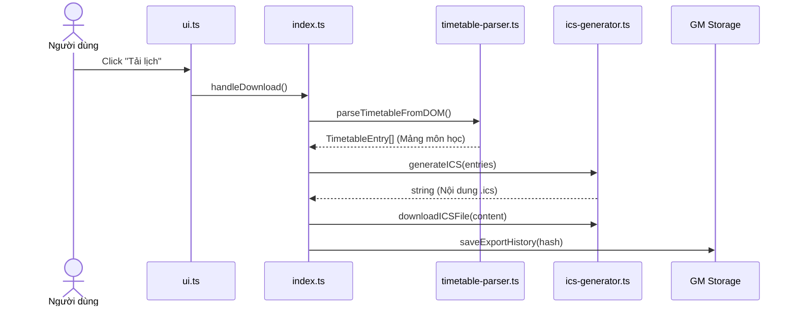
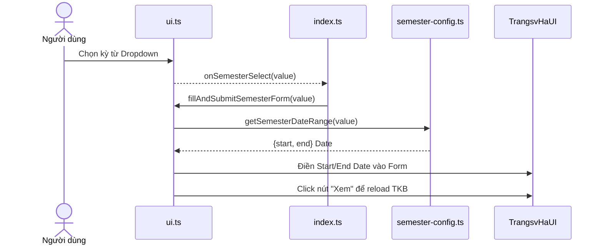

# Document: Calendar Export Feature (Tính năng Xuất Lịch)

Thư mục: `src/features/calendar-export`

## 1. Tổng quan (Overview)

Tính năng xuất lịch học từ trang thời khóa biểu sinh viên (svHaUI) sang định dạng ICS (iCalendar) để có thể thêm vào Google Calendar, Outlook, Apple Calendar, v.v.
Nó cung cấp giao diện thêm một nút "Tải lịch" và một dropdown chọn kỳ học (giúp tự động tính toán thời gian và tải lại trang). Dữ liệu lịch sử xuất cũng được lưu trữ thông qua hệ thống GM Storage.

## 2. Kiến trúc (Architecture) & File Structure

Tính năng được chia thành các file module độc lập theo nguyên tắc Separation of Concerns:

- `types.ts`: Định nghĩa toàn bộ các cấu trúc dữ liệu, interface (kiểu dữ liệu) dùng chung cho các thành phần con.
- `timetable-parser.ts`: Chịu trách nhiệm phân tích (parse) cú pháp HTML/DOM của bảng thời khóa biểu để trích xuất ra thông tin các môn học.
- `semester-config.ts`: Quản lý các cấu hình liên quan đến kỳ học, tính toán khoảng thời gian (ngày bắt đầu, ngày kết thúc) cho từng kỳ.
- `ics-generator.ts`: Nhận dữ liệu sinh ra từ file parser, sử dụng thư viện `ics` để chuyển đổi thành cấu trúc chuẩn iCalendar (ICS) và phục vụ việc tải file.
- `ui.ts`: Xử lý giao diện người dùng (tạo nút bấm, dropdown chọn kỳ học) và tương tác với DOM trên web (như điền form).
- `index.ts`: Controller chính `CalendarExportFeature` (kế thừa từ `Feature`). Điều phối luồng xử lý và kết nối các thành phần với nhau.

## 3. Luồng dữ liệu (Data Flow)

### 3.1. Luồng Xuất lịch (Export ICS)

1. **Người dùng click "Tải lịch"** trên UI (tạo ra từ `ui.ts`).
2. **Controller (`index.ts`)** gọi hàm `parseTimetableFromDOM` của `timetable-parser.ts`, đồng thời truyền bảng HTML chứa thời khóa biểu trên DOM vào.
3. **Parser** thực hiện duyệt qua bảng, trích xuất chuỗi bằng RegExp và trả ra mảng các môn học dưới dạng `TimetableEntry[]`.
4. **Controller** truyền mảng `TimetableEntry[]` đó gọi vào hàm `generateICS` của `ics-generator.ts`.
5. **Generator** ánh xạ các tiết học ra khoảng thời gian tương ứng, chuyển đổi múi giờ từ Local (VN) sang UTC, và sinh ra chuỗi văn bản theo chuẩn định dạng ICS.
6. **Controller** kích hoạt download file bằng hàm `downloadICSFile` (ở `ics-generator.ts`).
7. **Controller** lưu lịch sử xuất file (hash SHA-256 nội dung file, thời gian xuất, thời gian kỳ học) vào trong DB (GM storage).

### 3.2. Luồng Chọn học kỳ (Select Semester)

1. **Người dùng tiến hành chọn 1 kỳ học** từ dropdown trên giao diện.
2. **UI Callback** báo lại `semesterValue` (định dạng `20251`, `20252`, v.v.) qua sự kiện OnSelect cho Controller biết.
3. **Controller** ngay lập tức gọi hàm `fillAndSubmitSemesterForm(semesterValue)` bên tệp `ui.ts`.
4. Hàm này tiếp tục mượn hàm `getSemesterDateRange` bên `semester-config.ts` để đọc ra ngày `start` và `end` (`Date`) của kỳ học.
5. `ui.ts` dùng Javascript lấp đầy các ô input start/end trên website của trường, rồi trigger ấn nút **"Xem"** (nút xem tự động tải lại bảng lịch học tương ứng).

## 4. Chi tiết các tệp, hàm và tham số

### 4.1. `index.ts` - `CalendarExportFeature`

Lớp triển khai tính năng chính, bao quát toàn mảng.

- **Phương thức chính:**
  - `run()`: Entry point của tính năng, tìm khu vực nút bấm trên page và chạy lệnh Injects UI từ `ui.ts`.
  - `handleDownload()`: (private) Kết hợp Parse -> Generate ICS -> Tải xuống -> Lưu lịch sử vào Storage.
  - `handleSemesterSelect(semesterValue: string)`: (private) Kích hoạt khi có sự kiện chọn dropdown kỳ học.
  - `saveExportHistory(icsContent: string, entries: TimetableEntry[])`: (private) Băm nội dung file thành dạng SHA-256 để lưu thành bản ghi xuất lịch.
  - `hashContent(content: string)`: Hàm async dùng Web Crypto API để băm chuỗi nội dung văn bản.

### 4.2. `types.ts`

- **`TimetableEntry`**: Interface một buổi học (date, periods[], course, classCode, lecturer, phone, department, location).
- **`PeriodTimeSlot`**: Interface quy ước thời gian thực cho một tiết (period, start [HH:mm], end [HH:mm]).
- **`ExportHistoryEntry`**: Interface lưu giữ lại thao tác xuất File của tính năng lịch để làm lịch sử.

### 4.3. `timetable-parser.ts`

Chịu trách nhiệm bóc tách dữ liệu từ HTML/DOM.

- **Biến Regex nội bộ:** `REGEX_COURSE_INFO`, `REGEX_LECTURER`, `REGEX_LOCATION` sử dụng Named Capture Groups.
- **Hàm Xuất ngoài:**
  - `parseTimetableFromDOM(tableEl: HTMLTableElement)`: (Exported) Duyệt các phần tử tr, td của bảng, tìm đúng cột chứa lịch học sáng/chiều/tối để xử lý.
  - `parseTimetableFromHTML(html: string)`: (Exported) Khởi tạo Document/DOM parser tạm từ mã HTML đầy đủ thay vì phải từ element DOM thực.
- **Hàm Nội bộ:**
  - `parseBlock(block: string)`: Parse 1 đoạn văn bản thành đối tượng `TimetableEntry` nháp bằng regex.
  - `parseSessionCell(cellText: string, date: string)`: Tách các tiết học từ chuỗi text tại 1 session (vd: sáng) ra thành mảng array.

### 4.4. `ics-generator.ts`

Chuyển đổi các môn học trong Object sang thông tin Event cho Google Calendar.

- **Hàm Xuất ngoài:**
  - `generateICS(entries: TimetableEntry[], calendarName?: string): string`: Tạo và sinh chuỗi văn bản raw format `.ics` từ list các Entry.
  - `downloadICSFile(content: string, filename: string)`: Mở prompt ra lệnh trình duyệt tải mảng file `.ics` vừa sinh.
- **Hàm Nội bộ:**
  - `getTimeRange(periods: number[])`: Lookup mảng các tiết ra thành mốc block start/end thực sự.
  - `toEventAttributes(entry: TimetableEntry)`: Parse logic 1 Entry thành Object `EventAttributes` tương thích với chuẩn của module `ics`. Hàm này cũng ép múi giờ ở Việt Nam về dạng UTC.

### 4.5. `semester-config.ts`

Xử lý logic tính toán các ngày của học kỳ. Mã học kỳ quy ước: Mã năm nhập học + Số thứ tự kỳ (vd: `20251`, `20252`).

- **Hàm Trọng tậm:**
  - `generateSemesterOptions(currentYear?: number)`: Tạo danh sách cấu trúc `SemesterOption` hiển thị lên UI giới hạn trong 1 tham số hằng số `HISTORY_YEARS` năm trước đó.
  - `parseSemesterValue(value: string)`: Cắt ghép chuỗi Value ra biến object `{ calendarYear, term }`.
  - `getSemesterDateRange(value: string)`: Gọi tính toán biên khoảng thời gian dựa theo mapping các tháng đã định nghĩa.
  - `detectCurrentSemester(now?: Date)`: Cược đoán kỳ học hiển hành với Date cung cấp hiện hành.

### 4.6. `ui.ts`

Quản lý các elements giao diện được đưa vào webpage gốc.

- **Hàm UI rendering:**
  - `createCalendarExportUI(callbacks: UICallbacks): HTMLElement`: Hàm wrapper tạo ra một container cha và đẩy các con vào.
  - (Nội bộ) `createDownloadButton(onClick)`: Tạo thẻ button HTML có gắn class Bootstrap 3 cho logic tải lịch.
  - (Nội bộ) `createSemesterDropdown(onSelect)`: Khởi tạo Dropdown từ mảng dữ liệu lấy từ logic config và chèn thêm chia vạch separator giữa các năm.
- **Hàm DOM Hook (Điền form):**
  - `fillAndSubmitSemesterForm(semesterValue: string)`: Can thiệp thay đổi Value của các field form thời khóa biểu trên trường (#ctl03_inpStartDate..) sau đó bắt element để execute thao tác ấn nút "Xem" (Submit trigger tải lại danh sách học phần).
  - `readFormDateRange()`: Hàm lấy thông tin Start/End trực tiếp hiện có nằm trên input web.
  - `detectSemesterFromForm()`: Alias call của việc detect.
